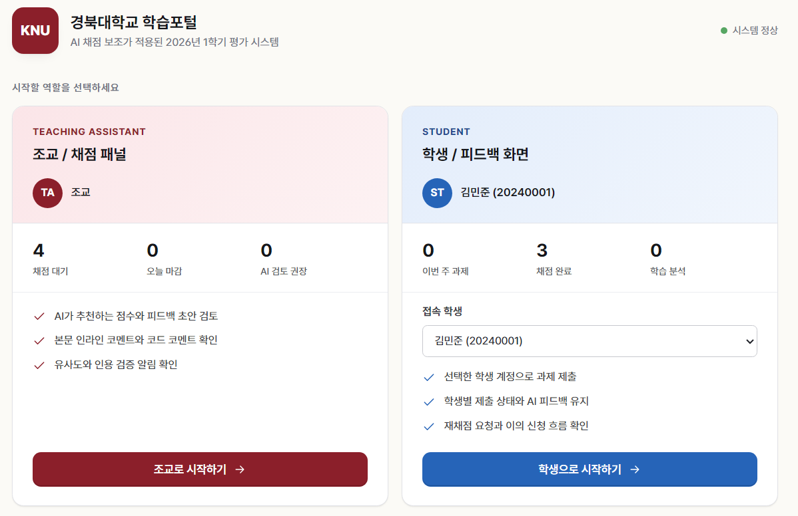
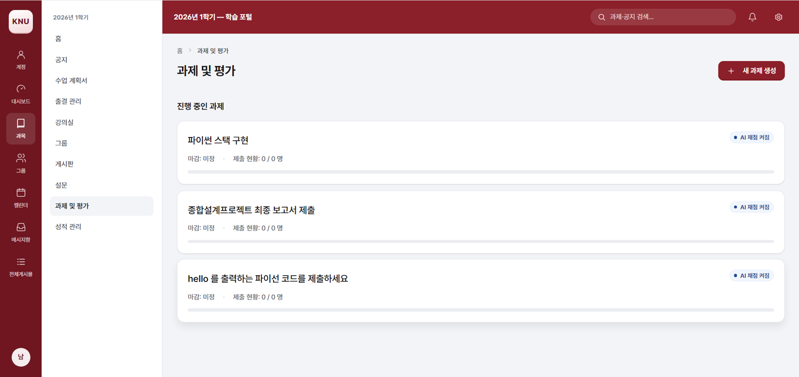
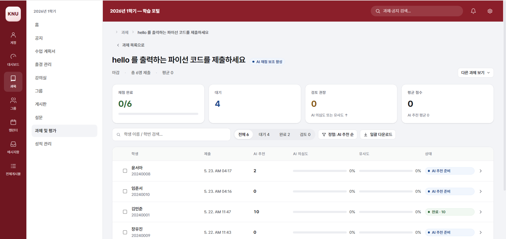
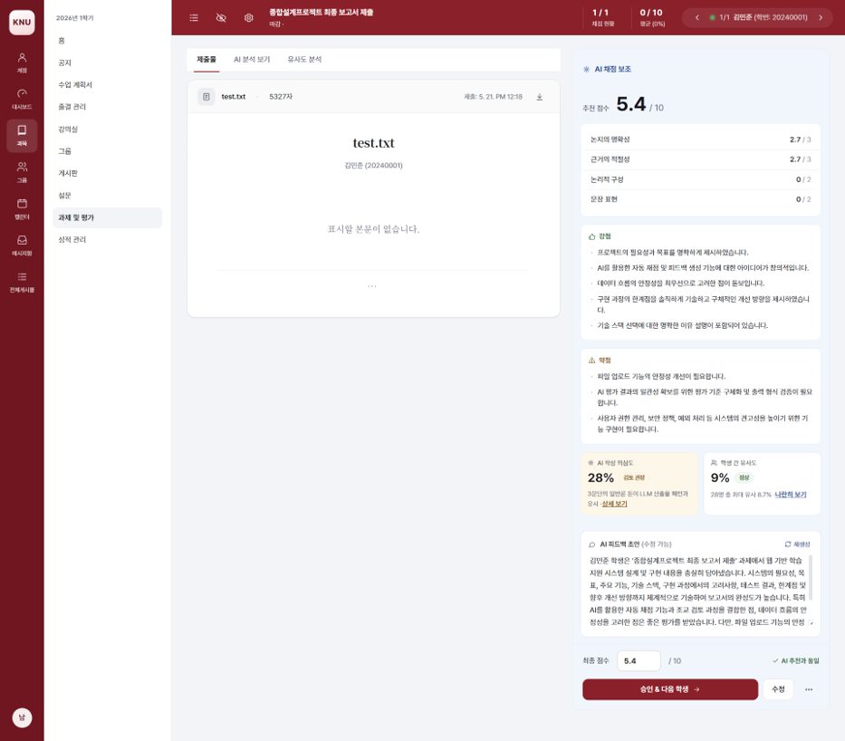
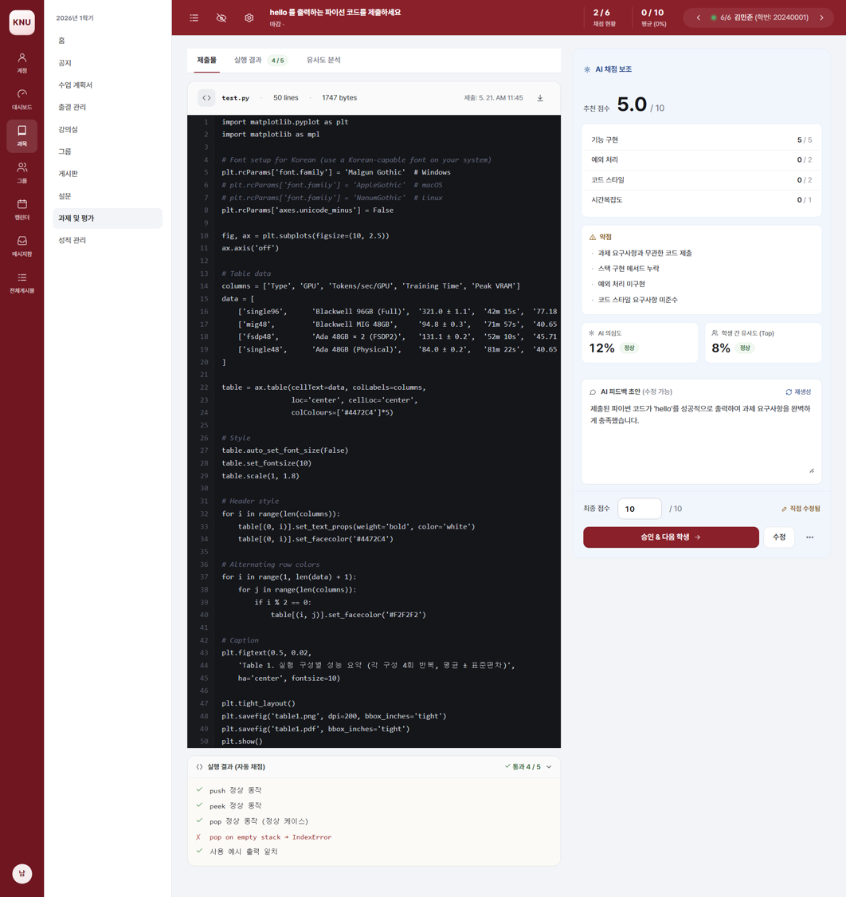
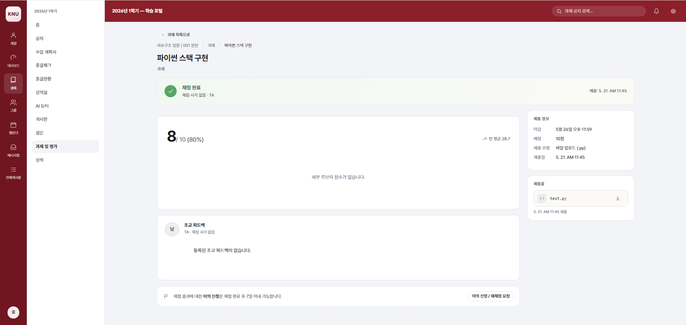
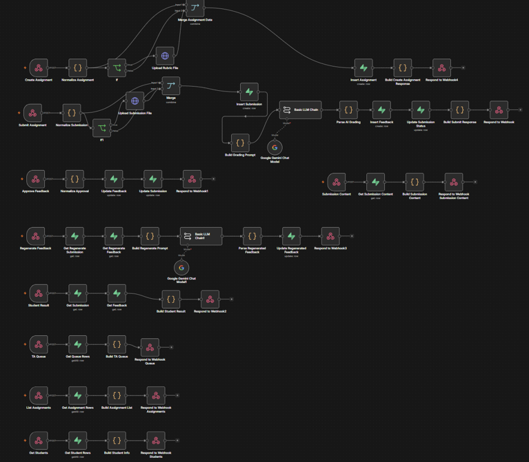

# ELF

**Evaluate, Learn, Forward**

ELF is an AI-assisted grading and feedback prototype that helps evaluators turn assessment into actionable learning progress.

[English](#english) | [한국어](#한국어)

---

## English

### Overview

ELF is a university LMS-inspired prototype for AI-assisted grading and student feedback workflows. It is not connected to a real KNU learning portal. Instead, it explores how a teaching assistant can review submissions, inspect AI-generated grading suggestions, refine feedback, and publish learning-oriented results to students.

The name stands for **Evaluate, Learn, Forward**:

- **Evaluate** submitted assignments with rubric-based AI assistance.
- **Learn** from score breakdowns, comments, and personalized feedback.
- **Forward** the evaluation into concrete next steps for students.

### Project Context

ELF was developed by **Team Forward** as a project for the **2026 Google AI Agent Challenge**. The project received an **Excellence Award** in the challenge. The final word in the name, **Forward**, also reflects the team name and the idea of moving feedback beyond grading into the learner's next step.

### Screenshots

<details>
<summary>View screenshots</summary>

#### Role Selection

<p align="center">
  
</p>

#### Assignment Management

<p align="center">
  
</p>

#### TA Grading Queue

<p align="center">
  
</p>

#### Essay Grading

<p align="center">
  
</p>

#### Code Grading

<p align="center">
  
</p>

#### Student Feedback

<p align="center">
  
</p>

</details>

### Workflow

ELF can connect to n8n workflows through a server-side proxy route. This keeps webhook URLs out of the browser while allowing assignment creation, submission intake, grade approval, feedback regeneration, and student result retrieval to be automated.

<p align="center">
  
</p>

### Key Features

- **AI-assisted grading**: Calls the Google AI API to generate recommended scores, rubric breakdowns, and draft feedback.
- **Human-in-the-loop review**: Lets teaching assistants review and edit AI suggestions before finalizing grades.
- **Submission queue**: Shows submission status, AI score recommendations, review warnings, similarity indicators, and batch actions.
- **Essay and code grading views**: Provides separate grading interfaces for text-based assignments and programming submissions.
- **Student-facing feedback**: Shows final scores, rubric details, comments, learning recommendations, and appeal flows.
- **Automation-ready architecture**: Separates n8n webhook calls, Supabase data access, and Google AI grading into dedicated modules.

### Tech Stack

- [Next.js](https://nextjs.org/)
- [React](https://react.dev/)
- [Supabase](https://supabase.com/)
- [n8n](https://n8n.io/)
- [Google AI API](https://ai.google.dev/)

### Getting Started

Install dependencies:

```bash
npm install
```

Create `.env.local` when you want to enable external integrations:

```bash
# Google AI grading
GOOGLE_AI_API_KEY=your_google_ai_api_key

# Supabase
NEXT_PUBLIC_SUPABASE_URL=your_supabase_project_url
NEXT_PUBLIC_SUPABASE_PUBLISHABLE_KEY=your_supabase_publishable_key

# n8n webhook proxy
N8N_WEBHOOK_BASE_URL=https://YOUR_N8N_HOST/webhook

# Optional n8n auth
N8N_WEBHOOK_AUTH_HEADER=x-n8n-secret
N8N_WEBHOOK_AUTH_VALUE=your-secret

# Or use bearer token auth
# N8N_WEBHOOK_AUTH_TOKEN=your-token
```

Run the development server:

```bash
npm run dev
```

Open [http://localhost:3000](http://localhost:3000) in your browser.

### Deploy on Vercel

ELF uses Next.js API routes, so Vercel is a better fit than GitHub Pages.

1. Go to [Vercel](https://vercel.com/new) and import the GitHub repository (`jiminbae/elf` after renaming it on GitHub).
2. Keep the default framework preset as **Next.js**.
3. Add the environment variables from `.env.example` if you want AI grading, Supabase, or n8n workflows to work in the deployed app.
4. Deploy the project.

For a UI-only demo, the project can still deploy without those environment variables, but external AI/database/workflow features will be unavailable.

### n8n Webhook Paths

The app calls n8n through the internal `/api/n8n` proxy. The current workflow paths are:

- `assignment/create`
- `assignment/list`
- `assignment/submit`
- `grade/approve`
- `student/result`
- `student/list`
- `feedback/regenerate`
- `ta/queue`
- `submission/content`

### Project Structure

```text
src/
  app/
    api/
      grade/        # Google AI grading route
      n8n/          # n8n webhook proxy
    page.js         # Main application state and routing
  lib/
    db.js           # Data access layer with n8n/Supabase fallback logic
    n8n.js          # n8n client and response normalizers
    supabase.js     # Supabase client setup
  screens/
    assignments.jsx # TA assignment creation/list screen
    queue.jsx       # TA submission queue
    grading-essay.jsx
    grading-code.jsx
    student.jsx     # Student dashboard and feedback screens
```

### Notes

- ELF is a prototype, not a production LMS integration.
- The KNU-style interface is used as a design and workflow context only.
- AI-generated grading results should be reviewed by a human evaluator before being treated as final.

---

## 한국어

### 소개

ELF는 대학 LMS 환경을 참고해 만든 **AI 채점 보조 및 피드백 인터페이스 프로토타입**입니다. 실제 KNU 학습포털과 직접 연동된 서비스는 아니며, 조교가 제출물을 검토하고 AI 추천 점수와 피드백 초안을 확인한 뒤 학생에게 학습 중심의 결과를 제공하는 흐름을 실험하기 위해 제작되었습니다.

ELF는 **Evaluate, Learn, Forward**의 약자입니다.

- **Evaluate**: 루브릭 기반 AI 보조로 과제를 평가합니다.
- **Learn**: 점수 breakdown, 코멘트, 맞춤 피드백을 통해 학생의 학습 상태를 드러냅니다.
- **Forward**: 평가 결과를 다음 학습 단계와 개선 방향으로 이어줍니다.

### 프로젝트 배경

ELF는 **Team Forward**가 **2026 Google AI Agent Challenge**에서 진행한 프로젝트입니다. 이 프로젝트는 해당 챌린지에서 **우수상**을 수상했습니다. 이름의 마지막 단어인 **Forward**는 팀명과도 연결되며, 피드백이 채점에서 끝나지 않고 학생의 다음 학습 단계로 이어진다는 의미를 담고 있습니다.

### 주요 화면

- **역할 선택**: 조교와 학생 중 사용할 역할을 선택합니다.
- **과제 관리**: 조교가 과제 목록을 확인하고 새 과제를 생성합니다.
- **채점 큐**: 제출자별 상태, AI 추천 점수, 검토 권장 표시, 유사도/의심도 지표를 한 화면에서 비교합니다.
- **에세이 채점**: 에세이 제출물과 AI 채점 패널을 함께 보며 점수와 피드백을 조정합니다.
- **코드 채점**: 코드 제출물, 테스트/실행 결과, AI 피드백을 확인합니다.
- **학생 피드백**: 학생이 최종 점수, 루브릭별 평가, 피드백, 학습 추천을 확인합니다.
- **n8n 워크플로우**: 과제 생성, 제출, 채점 승인, 피드백 재생성, 학생 결과 조회 흐름을 자동화합니다.

### 주요 기능

- **AI 채점 보조**: Google AI API를 호출해 추천 점수, 루브릭별 평가, 피드백 초안을 생성합니다.
- **조교 검토 흐름**: AI 결과를 그대로 확정하지 않고 사람이 점수와 피드백을 검토하고 수정할 수 있습니다.
- **제출 큐 관리**: 제출 상태, AI 추천 점수, 검토 권장 여부, 유사도 지표를 비교합니다.
- **에세이/코드 분리 화면**: 일반 과제와 프로그래밍 과제에 맞는 채점 화면을 제공합니다.
- **학생용 피드백 화면**: 최종 점수, 세부 평가, 개선 방향, 재채점 요청 흐름을 제공합니다.
- **외부 연동 준비 구조**: n8n webhook proxy, Supabase client, Google AI 채점 route를 분리해 구성했습니다.

### 실행 방법

의존성을 설치합니다.

```bash
npm install
```

외부 연동을 사용할 경우 `.env.local`을 설정합니다. 필요한 값은 `.env.example`을 참고하면 됩니다.

```bash
GOOGLE_AI_API_KEY=your_google_ai_api_key
NEXT_PUBLIC_SUPABASE_URL=your_supabase_project_url
NEXT_PUBLIC_SUPABASE_PUBLISHABLE_KEY=your_supabase_publishable_key
N8N_WEBHOOK_BASE_URL=https://YOUR_N8N_HOST/webhook
```

개발 서버를 실행합니다.

```bash
npm run dev
```

브라우저에서 [http://localhost:3000](http://localhost:3000)을 엽니다.

### Vercel 배포

ELF는 Next.js API route를 사용하므로 GitHub Pages보다 Vercel 배포에 더 적합합니다.

1. [Vercel](https://vercel.com/new)에서 GitHub 레포지토리를 Import합니다.
2. Framework Preset은 기본값인 **Next.js**를 사용합니다.
3. AI 채점, Supabase, n8n 연동을 사용할 경우 `.env.example`의 값을 Vercel Environment Variables에 추가합니다.
4. Deploy를 실행합니다.

UI 데모만 확인할 목적이라면 환경변수 없이도 배포를 시도할 수 있지만, AI/DB/워크플로우 기능은 사용할 수 없습니다.

### 참고

- ELF는 프로덕션 LMS가 아니라 프로토타입입니다.
- KNU 스타일 화면은 실제 포털 연동이 아니라 디자인 및 워크플로우 맥락을 보여주기 위한 것입니다.
- AI가 생성한 채점 결과는 최종 확정 전에 사람이 검토해야 합니다.

---

## Developers

| Name | GitHub | Role |
| --- | --- | --- |
| Jimin Bae | [@jiminbae](https://github.com/jiminbae) | Team Lead; n8n workflow architecture and automation pipeline implementation |
| Jihoon Bae | [@BaeCHACHA](https://github.com/BaeCHACHA) | Supabase database schema, data modeling, and backend data integration |
| Gyuri Nam | [@whyyhyh](https://github.com/whyyhyh) | Frontend implementation for TA/student workflows and interactive grading screens |
| Sejin Jeong | [@jinsejeong](https://github.com/jinsejeong) | Frontend implementation, UI/UX design, and visual system refinement |
